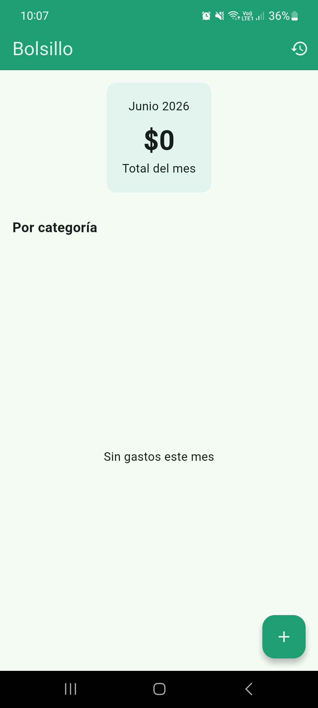
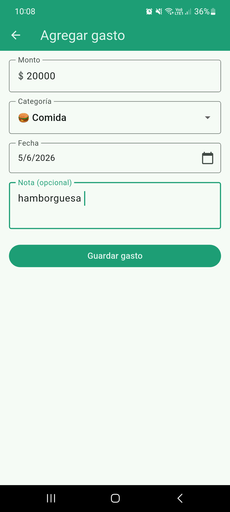
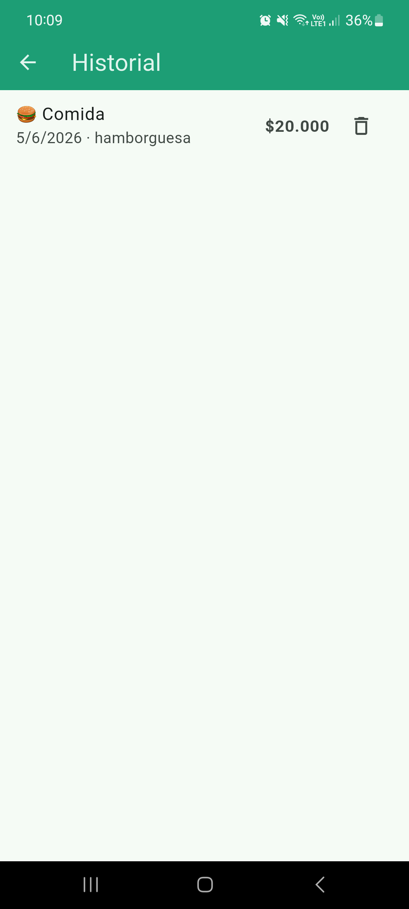
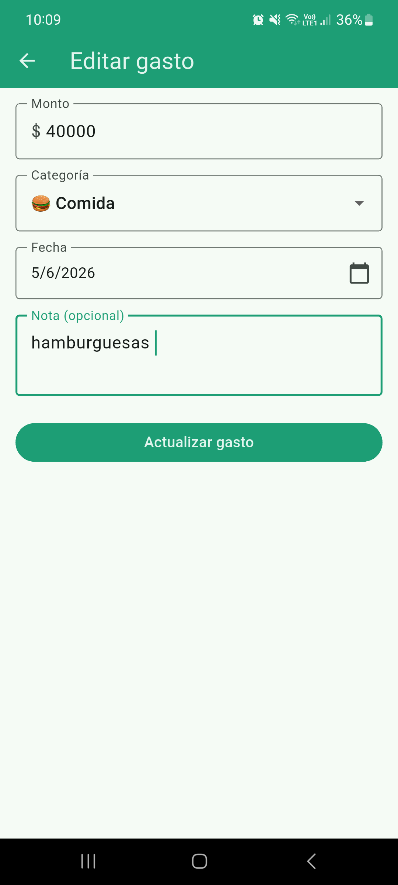
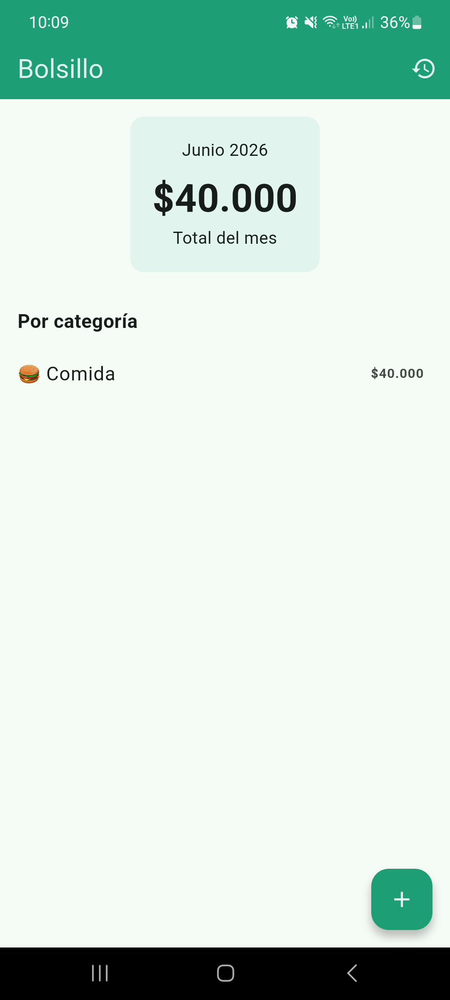
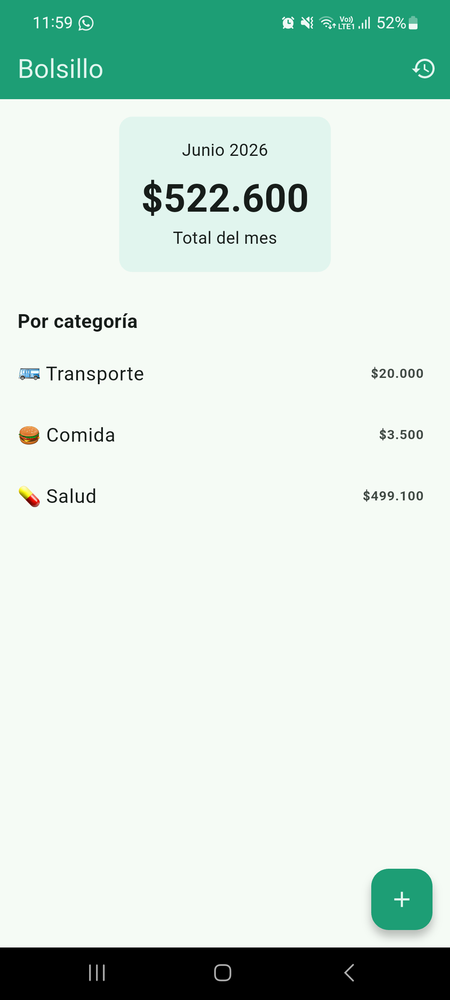

# Bolsillo 
> Registra y controla tus gastos personales desde el celular.
> Track and manage your personal expenses from your phone.

## Capturas de pantalla / Screenshots
| Inicio / Home | Agregar / Add | Historial / History |
|-----|-----|-----|
|  |  | | 

| Editar / Update | Inicio 2 / Home 2 | Inicio 3 / Home 3 |
|-----|-----|-----|
|  |  |  |


## Funcionalidades / Features
**Español**
- Registro de gastos con monto, categoría, fecha y nota opcional
- 9 categorías predefinidas
- Resumen mensual por categoría
- Historial completo de gastos
- Edición de gastos con long press
- Eliminación de gastos con confirmación
- Formato de montos en pesos colombianos

**English**
- Expense tracking with amount, category, date and optional note
- 9 predefined categories
- Monthly summary by category
- Full expense history
- Edit expenses with long press
- Delete expenses with confirmation
- Amount formatting in Colombian pesos

## Stack técnico / Tech Stack

| Tecnología | Uso |
|---|---|
| Flutter 3.41.9 | Framework |
| mobileDart 3.11.5 | Lenguaje |
| Provider | Manejo de estado |
| sqflite 2.4.2 | Base de datos local SQLite | 

## Arquitectura / Architecture
```
lib/
├── config/          # Tema, categorías y formatos
├── models/          # Expense — modelo de datos
├── repositories/    # Lógica de SQLite
├── providers/       # Estado global con ChangeNotifier
└── screens/         # HomeScreen, HistoryScreen, AddScreen
```

## Configuración / Setup
### 1. Clonar el repositorio / Clone the repository
```bash
git clone https://github.com/RojasVSantiago/flutter_bolsillo.git
cd flutter_bolsillo
```
### 2. Instalar dependencias / Install dependencies
```bash
flutter pub get
```
### 3. Correr la app / Run the app
```bash
flutter run
```

## Autor / Author

**Santiago Rojas**
- GitHub: [RojasVSantiago](https://github.com/RojasVSantiago)
- LinkedIn: [srojasv](https://www.linkedin.com/in/srojasv/)